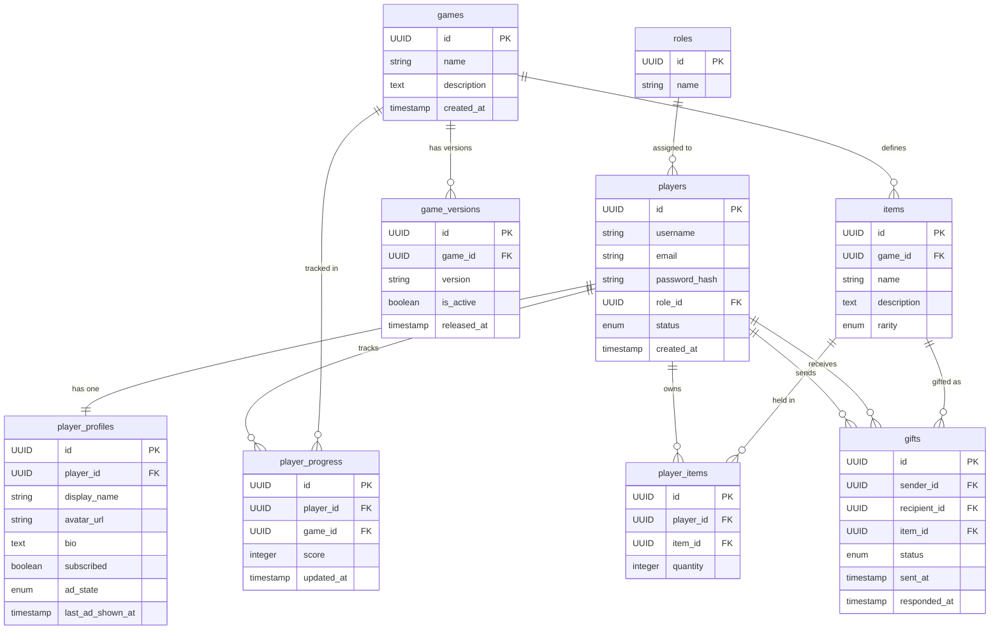

# GRIDFORGE — Database Entity Diagram

---

## Schema Reference

### `roles`
| Column | Type | Notes |
|---|---|---|
| id | UUID | PK |
| name | string | `dev` or `player` |

### `players`
| Column | Type | Notes |
|---|---|---|
| id | UUID | PK |
| username | string | unique |
| email | string | unique |
| password_hash | string | bcrypt |
| role_id | UUID | FK → roles |
| status | enum | `active` · `suspended` · `banned` |
| created_at | timestamp | |

### `player_profiles`
| Column | Type | Notes |
|---|---|---|
| id | UUID | PK |
| player_id | UUID | FK → players, CASCADE DELETE |
| display_name | string | |
| avatar_url | string | nullable |
| bio | text | nullable |
| subscribed | boolean | bypasses ads when true |
| ad_state | enum | `idle` · `ad_pending` · `ad_playing` |
| last_ad_shown_at | timestamp | nullable |

### `games`
| Column | Type | Notes |
|---|---|---|
| id | UUID | PK |
| name | string | |
| description | text | |
| created_at | timestamp | |

### `game_versions`
| Column | Type | Notes |
|---|---|---|
| id | UUID | PK |
| game_id | UUID | FK → games, CASCADE DELETE |
| version | string | e.g. `1.0.0` |
| is_active | boolean | |
| released_at | timestamp | |

### `player_progress`
| Column | Type | Notes |
|---|---|---|
| id | UUID | PK |
| player_id | UUID | FK → players, CASCADE DELETE |
| game_id | UUID | FK → games, CASCADE DELETE |
| score | integer | personal best only |
| updated_at | timestamp | |

UNIQUE constraint on `(player_id, game_id)`

### `items`
| Column | Type | Notes |
|---|---|---|
| id | UUID | PK |
| game_id | UUID | FK → games, CASCADE DELETE |
| name | string | |
| description | text | |
| rarity | enum | `common` · `rare` · `epic` · `legendary` |

### `player_items`
| Column | Type | Notes |
|---|---|---|
| id | UUID | PK |
| player_id | UUID | FK → players, CASCADE DELETE |
| item_id | UUID | FK → items, CASCADE DELETE |
| quantity | integer | |

UNIQUE constraint on `(player_id, item_id)`

### `gifts`
| Column | Type | Notes |
|---|---|---|
| id | UUID | PK |
| sender_id | UUID | FK → players |
| recipient_id | UUID | FK → players |
| item_id | UUID | FK → items |
| status | enum | `pending` · `accepted` · `rejected` |
| sent_at | timestamp | |
| responded_at | timestamp | nullable |

---

## Constraints & Design Notes

- **All primary keys are UUIDs** — no sequential IDs to enumerate or guess
- **CASCADE DELETE** on all child tables — removing a player or game cleans up all related rows automatically
- **`player_progress`** unique on `(player_id, game_id)` — one score record per player per game, upserted on submission
- **`player_items`** unique on `(player_id, item_id)` — quantity incremented instead of duplicate rows
- **`player_profiles`** is 1-to-1 with `players` — keeps the players table lean; ad state and subscription live here
- **`gifts.status`** transitions are irreversible: `pending → accepted` or `pending → rejected`, never back
- **`ad_state`** on `player_profiles` drives the ad lifecycle: `idle → ad_pending → ad_playing → idle`
